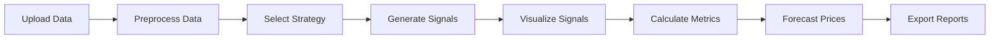

# 📊 Backtesting Engine v1.0

## 🚀 Overview
Backtesting Engine v1.0 is a simple yet powerful tool for backtesting trading strategies. It allows users to:
- Upload financial data 📂
- Preprocess it 🔧
- Apply various trading strategies 📈
- Visualize results interactively 🖼️

The application also provides performance metrics, price forecasting, and export options for reports.

---
## 📊 Diagram: Workflow of Backtesting Engine

## ✨ Features
### 🔍 **1. Data Upload**
- Upload your data in **CSV** or **Excel** format.
- View the uploaded data in a tabular format.

### 🛠️ **2. Data Preprocessing**
- Preprocess your data using the built-in `DataPreprocessor`.
- View the preprocessed data.

### 📈 **3. Strategy Selection**
Choose from a variety of trading strategies:
- Moving Average Crossover
- RSI Strategy
- Bollinger Bands
- MACD
- Breakout

### 📊 **4. Generate Trading Signals**
- Generate **buy**, **sell**, and **hold** signals based on the selected strategy.
- View the generated signals in a tabular format.

### 🖼️ **5. Interactive Trading Signals Visualizer**
- Visualize trading signals interactively using **Plotly**.

### 📉 **6. Performance Metrics**
- Calculate performance metrics for the generated signals.
- View the calculated metrics in a tabular format.

### 🔮 **7. Price Forecasting**
- Forecast future prices using the **ETS model**.
- Visualize the forecasted prices alongside historical prices.

### 📤 **8. Export Options**
- Export the generated signals and performance metrics as a **CSV** file.
- Export the report as a **PDF** file with a proper table.

### 📥 **9. Download Reports**
- Download the **CSV** or **PDF** report directly from the web app.

### 📂 **10. Sample OHLC File**
- A sample OHLC (Open, High, Low, Close) file is provided for users to download and test the application without hassle.

---

## 🛠️ Installation
1. Clone the repository:
   ```bash
   git clone https://github.com/pranshu-5123/backtesting-engine.git
   cd backtesting-engine
   ```
2. Install the required dependencies:
   ```bash
   pip install -r requirements.txt
   ```
---
## 📜 License
This project is licensed under the MIT License.
